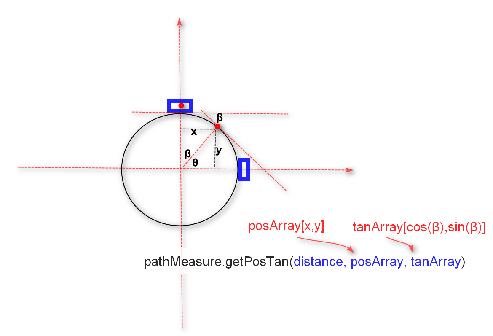
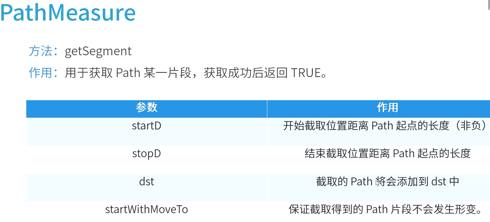
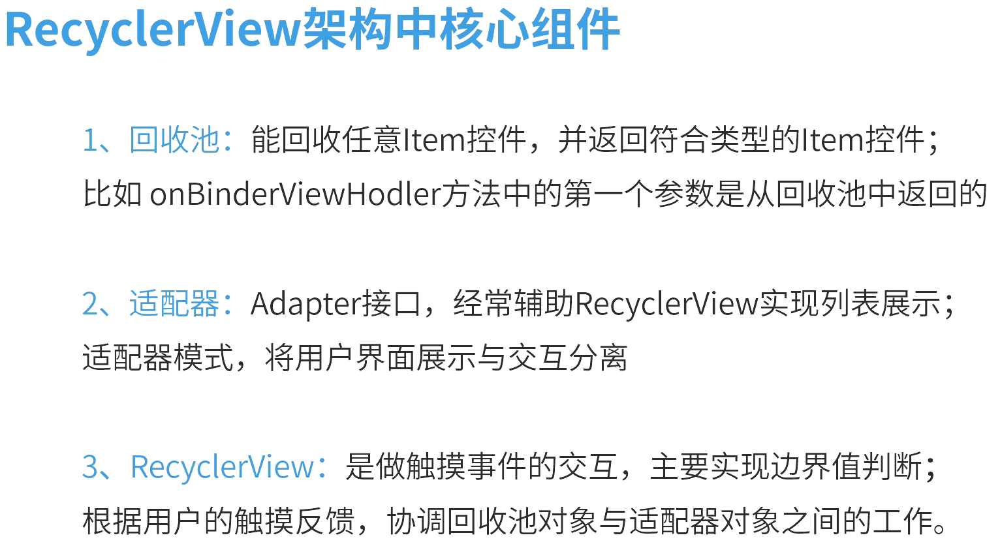
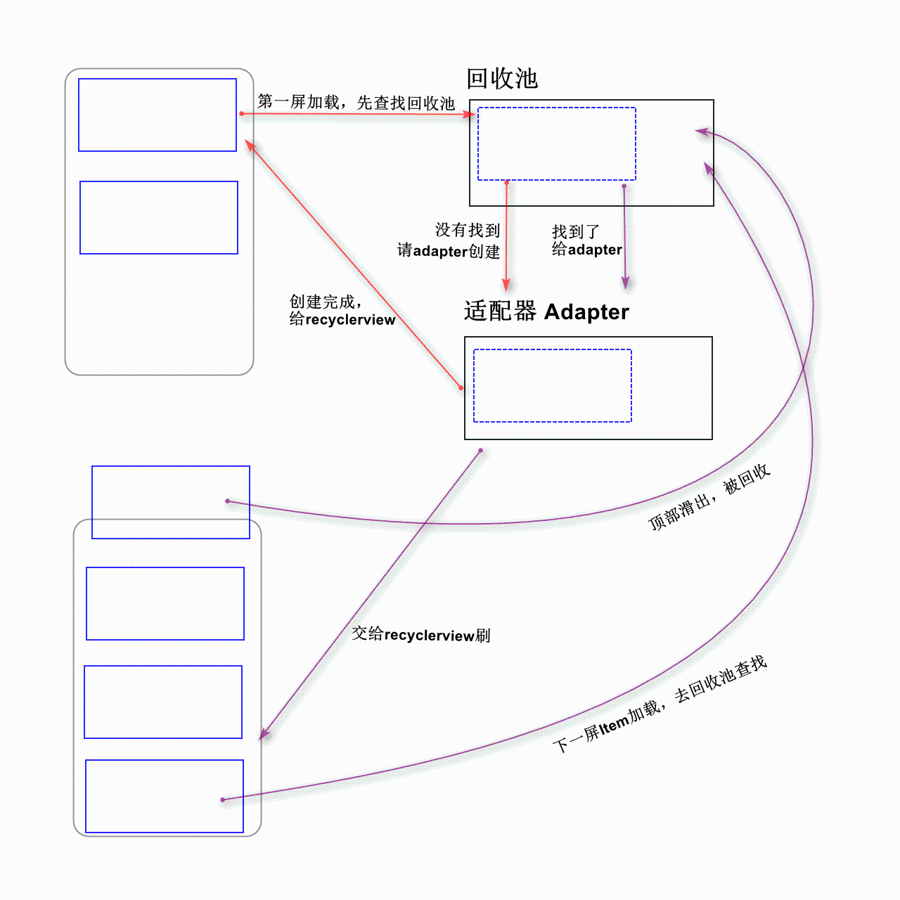
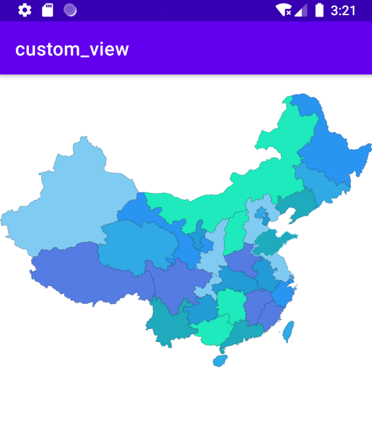
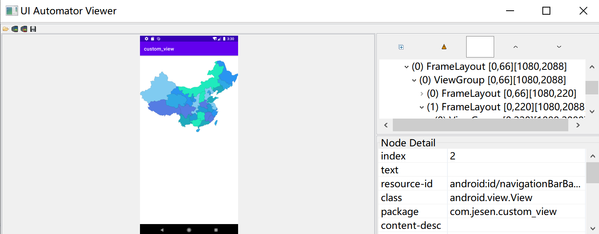
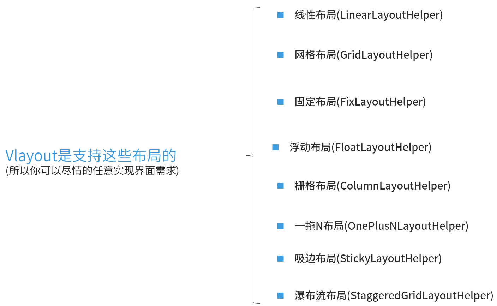

###  PathMeasure用法：
  * getPosTan方法
    boolean getPosTan(float distance，float pos[]， float tan[])

    | 参数      |   含义                                                               |
    | -------- | :-----:                                                             |
    | distance | 距离Path 起点的长度取值范围:0<= distance <= getLength                   |
    | pos[]    |该点的坐标值，pos[0]为x坐标、pos[1]为y坐标|
    | tan[]    |该点的正切值，tan[0]对应角度的cos值，对应X坐标。tan[1]对应角度的sin值，对应Y坐标|

  * getSegment方法
    boolean getSegment (float startD, float stopD, Path dst, boolean startWithMoveTo)
    作用：用于获取 Path 某一片段，获取成功后返回 TRUE。

    | 参数	|   作用                                                       |
    | -------- | :-----:                                                             |
    | startD	| 开始截取位置距离 Path 起点的长度（非负）|
    | stopD	    | 结束截取位置距离 Path 起点的长度       |
    | dst	    | 截取的 Path 将会添加到 dst 中         |
    |startWithMoveTo|	TRUE：保证截取得到的 Path 片段不会发生形变。|

  * 应用：
     圆形加icon旋转loading动画
     
     其中β就是icon旋转的角度，Icon的变换包括了不断旋转和平移重绘来完成动画。
     ```kotlin
      val distance = pathMeasure.length * distanceRatio
        pathMeasure.getPosTan(distance, posArray, tanArray)
        //计算icon本身要旋转的角度
        val degree = (atan2(
            tanArray[1].toDouble(),
            tanArray[0].toDouble()
        ) * 180 / Math.PI).toFloat()

        //设置旋转角度和旋转中心
        iconMatrix.postRotate(
            degree,
            (iconBitmap.width / 2).toFloat(),
            (iconBitmap.height / 2).toFloat()
        )

        //这里要将设置到Icon的中心点
        iconMatrix.postTranslate(posArray[0] - iconBitmap.width / 2, posArray[1] - iconBitmap.height / 2)
        canvas.drawPath(path, circlePaint)
        canvas.drawBitmap(iconBitmap, iconMatrix, iconPaint)
        postInvalidate()   
     ```











需要声明哪些成员变量呢
1 List<View> viewList :缓存已经加载到屏幕上的View 这些View不存在回收池中，需要集合表示，
方便后续查找和移除
2 int currentY::记录在Y轴上滑动的距离
3int rowCount::记录在RecyclerView加载的总数据，比如1w条
4int firstRow::记录在屏幕中第一个View在数据内容中的位置，比如目前是第34个元素在屏幕
的一个位置
5Recycler recycler: :持有一个回收池的引用
6 int srollY: RecyclerView中第一个View的左上顶点力离屏幕的距离


### SVG
SVG的使用：
    1、App图标:能SDK23后, APP的图标都是由SVG来表示
    2、自定义控件:不规则的控件，复杂的交互，子控件重叠判断，图表等都可以用SVG来做
    3、复杂动画:如根据用户滑动动态显示动画，路径动画.
SVG基本语法：
    M = moveto(M X,Y) :将画笔移动到指定的坐标位置
    L = lineto(L X,Y) :画直线到指定的坐标位置
    H = horizontal lineto(H X):画水平线到指定的X坐标位置
    V = vertical lineto(VY):画垂直线到指定的Y坐标位置
    C= curveto(C X1,Y1,X2,Y2,ENDX,ENDY):三次贝赛曲线
    S= smooth curveto(S X2,Y2,ENDX,ENDY)
    Q = quadratic Belzier curve(Q X,Y,ENDX,ENDY):二次贝赛曲线
    Z = closepath():关闭路径

[SVG资源下载](https://www.amcharts.com/download/)

关键代码：
```java
    private Thread loadThread = new Thread() {
        @Override
        public void run() {
            final InputStream inputStream = context.getResources().openRawResource(R.raw.china);
            DocumentBuilderFactory factory = DocumentBuilderFactory.newInstance();  //取得DocumentBuilderFactory实例
            DocumentBuilder builder = null; //从factory获取DocumentBuilder实例
            try {
                builder = factory.newDocumentBuilder();
                Document doc = builder.parse(inputStream);   //解析输入流 得到Document实例
                Element rootElement = doc.getDocumentElement();
                NodeList items = rootElement.getElementsByTagName("path");
                float left = -1;
                float right = -1;
                float top = -1;
                float bottom = -1;
                List<ProviceItem> list = new ArrayList<>();
                for (int i = 0; i < items.getLength(); i++) {
                    Element element = (Element) items.item(i);
                    String pathData = element.getAttribute("android:pathData");
                    @SuppressLint("RestrictedApi")
                    Path path = PathParser.createPathFromPathData(pathData);
                    ProviceItem proviceItem = new ProviceItem(path);
                    proviceItem.setDrawColor(colorArray[i % 7]);
                    RectF rect = new RectF();
                    path.computeBounds(rect, true);
                    left = left == -1 ? rect.left : Math.min(left, rect.left);
                    right = right == -1 ? rect.right : Math.max(right, rect.right);
                    top = top == -1 ? rect.top : Math.min(top, rect.top);
                    bottom = bottom == -1 ? rect.bottom : Math.max(bottom, rect.bottom);
                    list.add(proviceItem);
                }
                itemList = list;
                totalRect = new RectF(left, top, right, bottom);
                //  刷新界面
                Handler handler = new Handler(Looper.getMainLooper());
                handler.post(new Runnable() {
                    @Override
                    public void run() {
                        requestLayout();
                        invalidate();
                    }
                });

            } catch (Exception e) {
                e.printStackTrace();
            }
        }
    };

```

实现效果：



### VLayout的使用

查看布局：
进入SDK路径 `D:\Android\android-sdk-windows\tools\bin\uiautomatorviewer.bat`




VLayout特点：

   * 美团，手机淘宝和一般项目的首页展示
   * 可以实现强排版强交互的需求(特别适合电商的展示)
   * 适合列表中嵌套列表(如RecyclerView嵌套RecyclerView)
   * 列表，网格，瀑布流混合布局

###  唱片效果


   * 图层叠加LayerDrawable
     叠加技术︰LayerDrawable 对应的XML标签是<layer-list>，它表示一种层次化的Drawable 集合
     ，通过将不同的 Drawable 放置在不同的层上面从而达到一种叠加后的效果。


