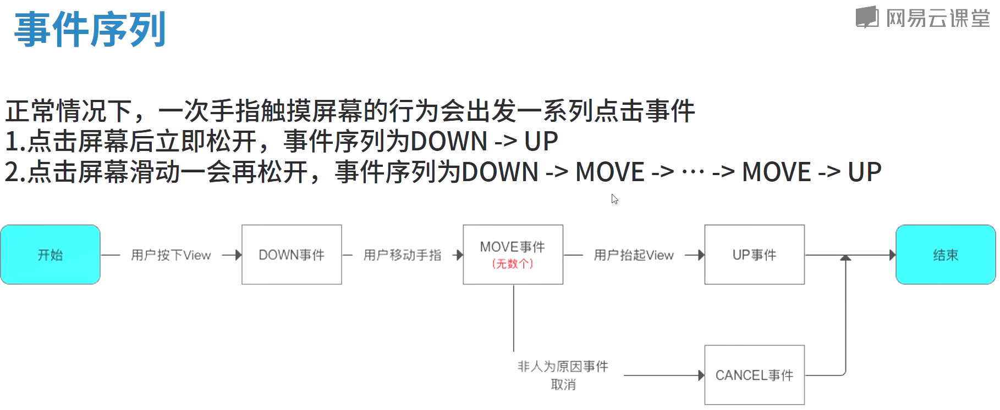
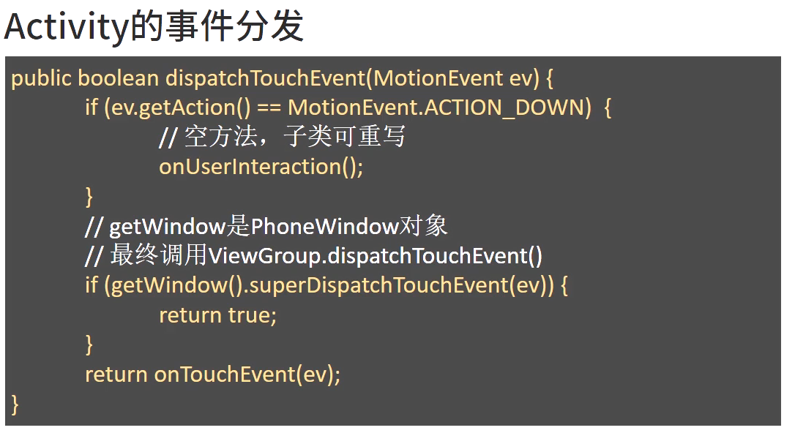

# 事件分发

#### 概览

1. 事件拦截主要方法：

    * dispatchTouchEvent(MotionEvent ev):用来进行事件分发
    * onlnterceptTouchEvent(MotionEvent ev):判断是否拦截事件(只存在于ViewGroup中)
    * onTouchEvent(MotionEvent ev):处理点击事件

4. 总结

    > * 一个事件序列从手指接触屏幕到手指离开屏幕，在这个过程中产生一系列事件，以DOWN事件开始，中间含有不定数的MOVE事件，以UP事件结束
      * 正常情况下，一个事件序列只能被一个View拦截并且消耗
      * 某个View一旦决定拦截，那么这个事件序列都将由它的onTouchEvent处理,并且它的onInterceptTouchEvent不会再调用
      * 某个View一旦开始处理事件，如果它不消耗ACTION_DOWN事件(onTouchEvent返回false)，那么同一事件序列中其他事件都不会再交给它处理。并且重新交由它的父元素处理(父元素onTouchEvent被调用)
      * 事件的传递过程是由外向内的，即事件总是先传递给父元素，然后再由父元素分发给子View，通过requestDisallowlnterceptTouchEvent方法可以在子View中干预父元素的事件分发过程，但ACTION_DOWN除外
      * ViewGroup默认不拦截任何事件，即onInterceptTouchEvent默认返回false。View没有onlnterceptTouchEvent方法，一旦有点击事件传递给它，那么它的onTouchEvent方法就会被调用
      * View的onTouchEvent默认会消耗事件(返回true),除非它是不可点击的(clickable和longClickable同时为false)。View的longClickable默认都为false，clickable要分情况，比如Button的clickable默认为true,TextView的clickable默认为false
      * View的enable属性不影响onTouchEvent的默认返回值。哪怕一个View是disable状态的，只要它的clickable或者longClickable有一个为true,那么它的onTouchEvent就返回true
      * onClick会响应的前提是当前View是可点击的,并且收到了ACTION_DOWN和ACTION_UP的事件,并且受长按事件影响，当长按事件返回true时，onClick不会响应。
      * onLongClick在ACTION_DOWN里判断是否进行响应，要想执行长按事件该View必须是longClickable的并且设置了OnLongClickListener

5. 问题

* 
