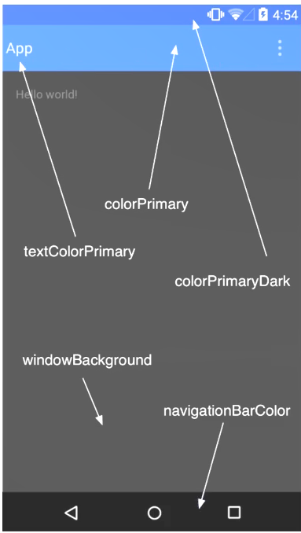

* Material Design交互,常用控件
     - Toolbar
     - DrawerLayout
     - NavigationView/BottomNavigationView
     - FloatingActionButton
     - Snackbar
     - CardView
     - CoordinatorLayout
     - AppBarLayout
     - CollapsingToolbarLayout
     - NestedScrollView

###  自定义控件
