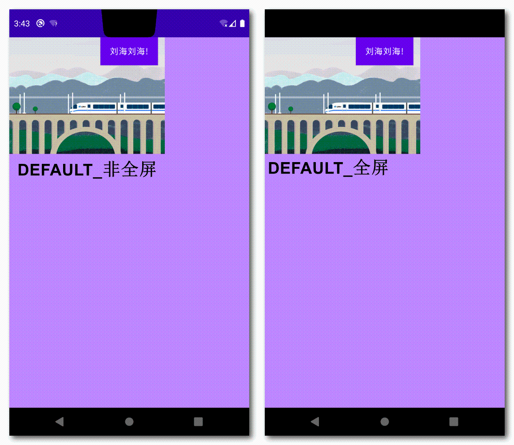
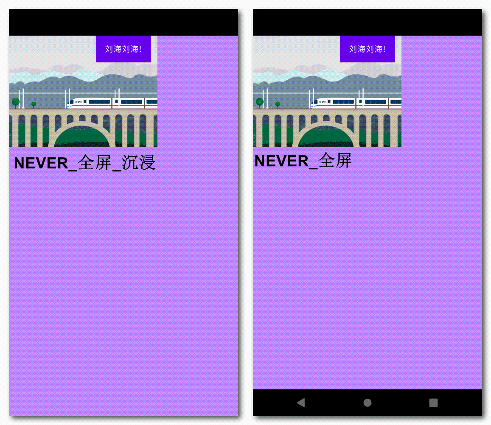
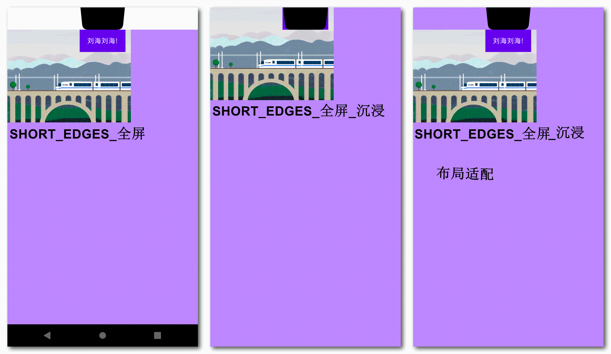

# 动画

### 自定义容器开发 自定义Layoutlnflater 自定义动画 如何对系统控件添加自定义属性

### 引导页平行动画


平行动画一般用在app启动页，页面中的元素或背景具有联动性或者整体移动的效果：


### 屏幕适配

1. 各种屏幕适配方式：

* **限定符适配**- App会根据当前手机的分辨率自动选择对应的dimens.xml

  > 分辨率限定符drawable-hdpi,drawable-xdpi,...  
  > 尺寸限定符layout-small,layout-large.... 最小宽度限定符values-sw360dp,
  > values-sw384dp,...  
  > 屏幕方向限定符layout-land, layout-port

  * 使用简单,无需要开发者手动指定
  * Google推荐使用方式,有系统自己判断
  * 适配通过不同的xml布局完成,无需再代码中额外再写
  * **缺点**：apk大小占用过大，无法保证所有机型


* **百分比适配**
  * 通过百分比定义宽度高度,比较方便
  * 彻底抛弃px dp单位，通过百分比实现，可以在布局完成适配
  * 对开发者工作量少
  * **缺点**:只能使用它提供的5种布局，限制太大

* **代码动态适配**
  * **缺点**：代码侵入性比较强

  * **自定义像素适配：**

    > 主要是对控件属性做等比缩放，缩放系数可以根据UI提供的标准尺寸和屏幕实际尺寸计算得出。

  * **百分比布局适配：**
    以父容器尺寸做为参考，在View的加载过程，根据当前父容器实际尺寸换算出目标尺寸，再作用在View上。

```java
        
   protected void onMeasure(int widthMeasureSpec, int heightMeasureSpec) {
        //获取父容器的宽高
        int width = MeasureSpec.getSize(widthMeasureSpec);
        int height = MeasureSpec.getSize(heightMeasureSpec);
        for (int i = 0; i < getChildCount(); i++) {
            View child = getChildAt(i);//重新设置子view的布局属性,再进行View的测量
            LayoutParams lp = (LayoutParams) child.getLayoutParams();
            //自定百分比属性
            float widthPercent = ((LayoutParams) lp).widthPercent;
            if (widthPercent > 0) {
                lp.width = (int) (width * widthPercent);//设置当前View在父容器中尺寸占}
            }
            super.onMeasure(widthMeasureSpec, heightMeasureSpec);
        }
    }
    
```

* **修改像素密度：**

> 修改density,scaleDensity,densityDpi值-直接更改系统内部对于目标尺寸而言的像素密度。

* 刘海屏适配 对于刘海屏，谷歌提供的适配方案是：
  可以通过给window设置一个WindowManager.LayoutParams属性，来决定我们的应用是否打算在全屏模式下使用缺口区域。
  在全屏模式下，如果控件布局想要避开凹槽区留下一个安全区域，就需要有一个方法来获取刘海槽口的高度。
  谷歌从Android P开始为刘海屏提供支持，目前提供了一个类和三种模式：
  可以用WindowInsets类的** getDisplayCutout() **
  这个方法得到cutout的位置和大小。

  **Android官方9.0刘海屏适配策略**

       > 如果非全屏模式(有状态栏)，则app不受刘海屏的影响，刘海屏的高就是状态栏的高
         如果全屏模式，app未适配刘海屏，系统会对界面做特殊处理，竖屏向下移动，横屏向右移动

  ```java
     // Activity中全屏的设置
     requestWindowFeature(Window.FEATURE_NO_TITLE);
     Window window = getWindow();
     window.setFlags(WindowManager.LayoutParams.FLAG_FULLSCREEN, WindowManager.LayoutParams.FLAG_FULLSCREEN);

  ```

  刘海屏凹槽选取模式选择，共有三种，默认是LAYOUT_IN_DISPLAY_CUTOUT_MODE_DEFAULT：

  ```java
     WindowManager.LayoutParams params = window.getAttributes();
          /**
           *  LAYOUT_IN_DISPLAY_CUTOUT_MODE_DEFAULT 全屏模式，内容下移，非全屏不受影响
           *  LAYOUT_IN_DISPLAY_CUTOUT_MODE_SHORT_EDGES 允许内容去延伸进刘海区
           *  LAYOUT_IN_DISPLAY_CUTOUT_MODE_NEVER 不允许内容延伸进刘海区
           */
          params.layoutInDisplayCutoutMode = WindowManager.LayoutParams.LAYOUT_IN_DISPLAY_CUTOUT_MODE_SHORT_EDGES;
          window.setAttributes(params);  
  ```

  * LAYOUT_IN_DISPLAY_CUTOUT_MODE_DEFAULT 全屏模式，内容下移，非全屏不受影响
    
  * LAYOUT_IN_DISPLAY_CUTOUT_MODE_SHORT_EDGES 允许内容去延伸进刘海区
    
  * LAYOUT_IN_DISPLAY_CUTOUT_MODE_NEVER 不允许内容延伸进刘海区
    

  **判断是否是刘海屏**

  ```
    DisplayCutout displayCutout;
      View rootView = window.getDecorView();
      WindowInsets insets = null;
      if (android.os.Build.VERSION.SDK_INT >= android.os.Build.VERSION_CODES.M) {
           insets = rootView.getRootWindowInsets();
      }
      if (Build.VERSION.SDK_INT >= Build.VERSION_CODES.P && insets != null){
          displayCutout = insets.getDisplayCutout();
          if (displayCutout != null){
              if (displayCutout.getBoundingRects() != null
                      && displayCutout.getBoundingRects().size() >0
              && displayCutout.getSafeInsetTop() >0){
                  Log.d("HHHH","Yes, has cutout.");
                  return true;
              }
          }
      }
      return false;  
  ```

  > 其他手机厂商（华为，小米，oppo，vivo）适配规则
  > [华为:https://devcenter-test.huawei.com/consumer/cn/devservice/doc/50114](https://devcenter-test.huawei.com/consumer/cn/devservice/doc/50114)
  > [小米:https://dev.mi.com/console/doc/detail?pId=1293](https://dev.mi.com/console/doc/detail?pId=1293)
  > [oppo:https://open.oppomobile.com/service/message/detail?id=61876](https://open.oppomobile.com/service/message/detail?id=61876)
  > [vivo:https://dev.vivo.com.cn/documentCenter/doc/103](https://dev.vivo.com.cn/documentCenter/doc/103)

