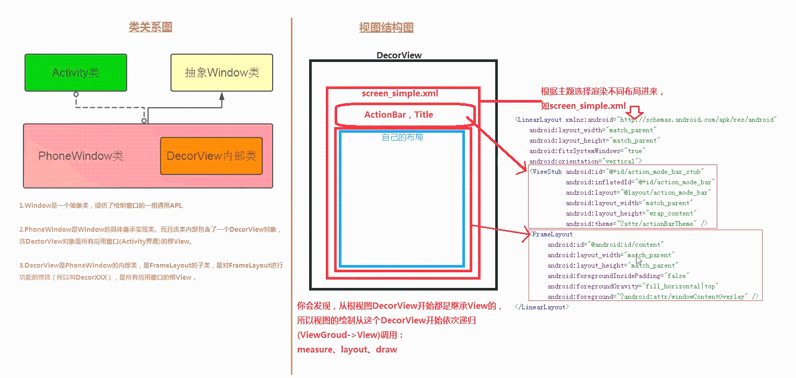
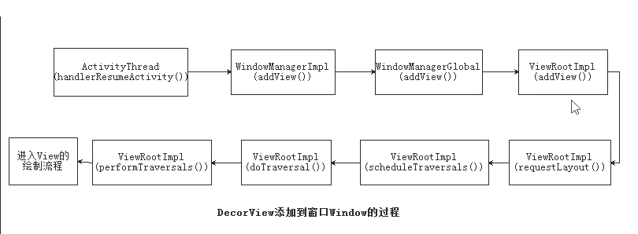
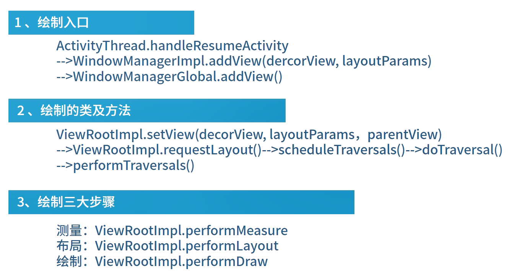
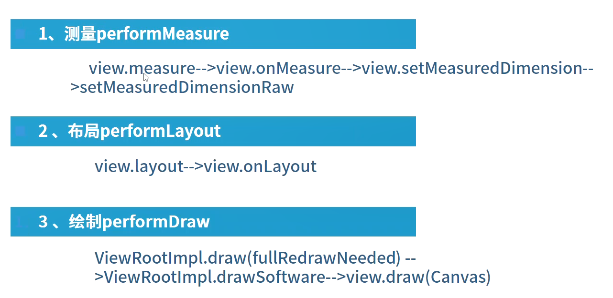
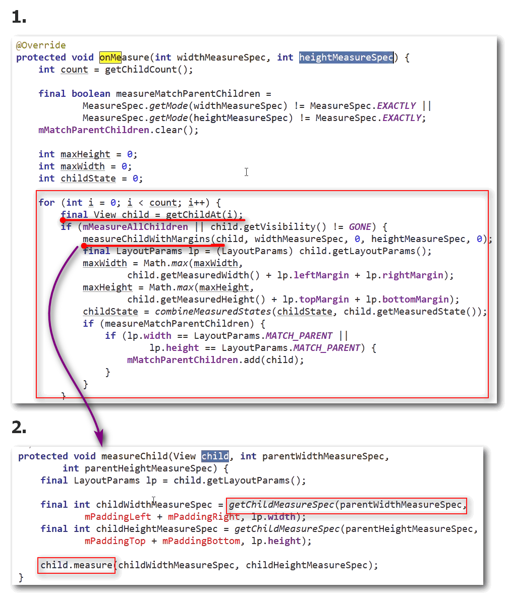
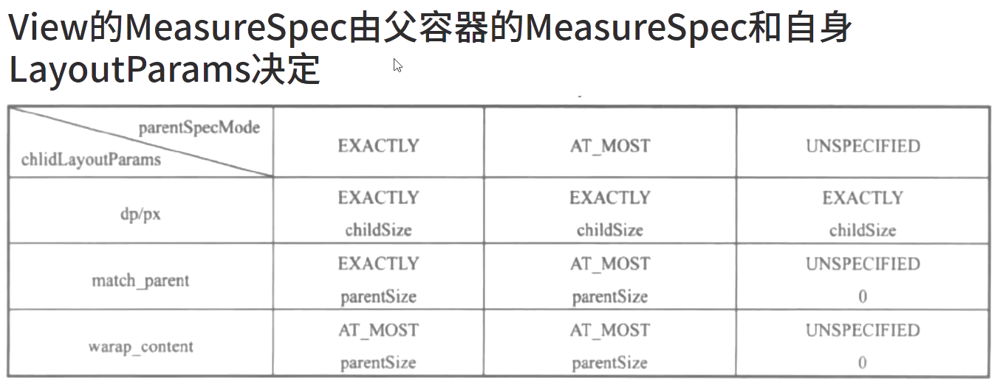
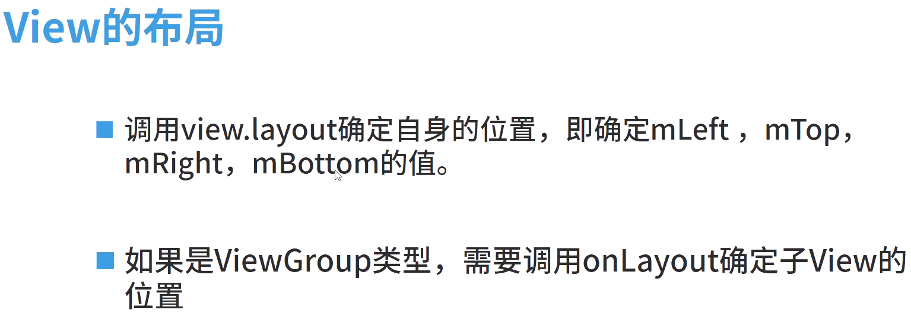
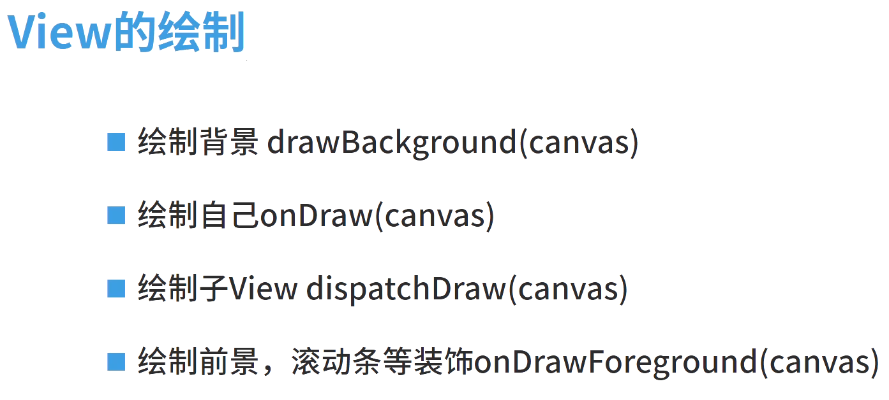

# AndUITalk

android UI的总结

### 布局文件加载









    View测量 = 模式 + 尺寸 -> MeasureSpec(32位int值)

    MODE_MASK : 11000000000000000000000000000000
    SpeclMode（前2位）+SpecSize(后30)

```java
 // 父容器不对View做限制，想多大就多大
 public static final int UNSPECIFIED = 0 << MODE_SHIFT; //00000000000000000000000000000000
 // 精确大小，父容器检测View的大小，View的大小就是SpecSize, 
 // 子控件match_parent，layout_width或layout_height指定为具体数值时
 public static final int EXACTLY = 1 << MODE_SHIFT; //01000000000000000000000000000000
 // 父容器指定一个可用大小(warp_content)，View的大小只要不超过不这个值，这个值就是MeasureSpec的size
 // View大小一般随着控件的子空间或内容进行变化，此时控件尺寸只要不超过父控件允许的最大尺寸即可。因此，此时的mode是AT_MOST，size给出了父控件允许的最大尺寸
 public static final int AT_MOST = 2 << MODE_SHIFT: //11000000000000000000000000000000

```

    MeasureSpec 提供的常用方法：

```java
    // `makeMeasureSpec`方法会将 mode + size 打包成为一个MeasureSpec
    public static int makeMeasureSpec(int size, int mode)

    // 得到这个变量中表示的模式信息，将得到的值与三个常量进行比较
    public static int getMode(int measureSpec)

    // 得到这个变量中表示的尺寸大小size的值
    public static int getSize(int measureSpec)

    // 把measureSpec变量里面的模式和大小组成字符串返回来，方便打日志
    public static String toString(int measureSpec)
```

* **如何确定DecorView的MeasureSpec**
  DecorView的MeasureSpec由窗口window大小和自身LayoutParams决定，遵守如下规则：
  * LayoutParams.MATCH_PARENT:精确模式，窗口大小
  * LayoutParams.WRAP_CONTENT:最大模式，最大为窗口大小
  * 固定大小：精确模式，大小为LayoutParams的大小



    获取子View测量空间：

```java
// padding:父容器已经用掉的大小
public static int getChildMeasureSpec(int spec, int padding, int childDimension) {
        int specMode = MeasureSpec.getMode(spec);
        int specSize = MeasureSpec.getSize(spec);
        int size = Math.max(0, specSize - padding);
        int resultSize = 0;
        int resultMode = 0;

        switch (specMode) {
        case MeasureSpec.EXACTLY: // 父容器是精确大小
            if (childDimension >= 0) { // 如果子view设置的是固定数字
                resultSize = childDimension;
                resultMode = MeasureSpec.EXACTLY;
            } else if (childDimension == LayoutParams.MATCH_PARENT) { // 如果子view是MATCH_PARENT
                // Child wants to be our size. So be it.
                resultSize = size;
                resultMode = MeasureSpec.EXACTLY;
            } else if (childDimension == LayoutParams.WRAP_CONTENT) { 
                // Child wants to determine its own size. It can't be
                // bigger than us.
                resultSize = size;
                resultMode = MeasureSpec.AT_MOST;
            }
            break;

        // 如果父容器设置的是AT_MOST
        case MeasureSpec.AT_MOST:
            if (childDimension >= 0) {
                // Child wants a specific size... so be it
                resultSize = childDimension;
                resultMode = MeasureSpec.EXACTLY;
            } else if (childDimension == LayoutParams.MATCH_PARENT) {
                // Child wants to be our size, but our size is not fixed.
                // Constrain child to not be bigger than us.
                resultSize = size;
                resultMode = MeasureSpec.AT_MOST;
            } else if (childDimension == LayoutParams.WRAP_CONTENT) {
                // Child wants to determine its own size. It can't be
                // bigger than us.
                resultSize = size;
                resultMode = MeasureSpec.AT_MOST;
            }
            break;

        // 如果父容器是UNSPECIFIED
        case MeasureSpec.UNSPECIFIED:
            if (childDimension >= 0) {
                // Child wants a specific size... let him have it
                resultSize = childDimension;
                resultMode = MeasureSpec.EXACTLY;
            } else if (childDimension == LayoutParams.MATCH_PARENT) {
                // Child wants to be our size... find out how big it should
                // be
                resultSize = View.sUseZeroUnspecifiedMeasureSpec ? 0 : size;
                resultMode = MeasureSpec.UNSPECIFIED;
            } else if (childDimension == LayoutParams.WRAP_CONTENT) {
                // Child wants to determine its own size.... find out how
                // big it should be
                resultSize = View.sUseZeroUnspecifiedMeasureSpec ? 0 : size;
                resultMode = MeasureSpec.UNSPECIFIED;
            }
            break;
        }
        //noinspection ResourceType
        return MeasureSpec.makeMeasureSpec(resultSize, resultMode);
    }
    
```

* 测量参数关系 

* View的布局 

* View的绘制 

---

* 总结：
  * 测量：
    * `ViewGroup` measure
      -->onlleasure(测量子控件的宽高)-->setlleasuredDimension
      -->setMeasuredDimensionRaw(保存自己的宽高)
    * `View`
      measure-->onlMeasure-->setlMeasuredDimension-->setlMeasuredDimensionRaw(保存自己的宽高)

  * 布局：
    * `ViewGroup`
      layout（来确定自己的位置，4个点的位置）-->onLayout（进行子View的布局）
    * `View` 1ayout(来确定自己的位置，4个点的位置）

  * 绘制
    * `ViewGroup`
      * 绘制背景drawBackground(canyas)
      * 绘制自己onDraw(canvas)
      * 绘制子View dispatchDraw(canvas)
      * 绘制前景，滚动条等装饰onDrawForeground(canvas)
    * `View`
      * 绘制背景 drawBackground(canvas)
      * 绘制自己onDraw(canvas)
      * 绘制前景，滚动条等装饰onDrawForeground(canvas)


