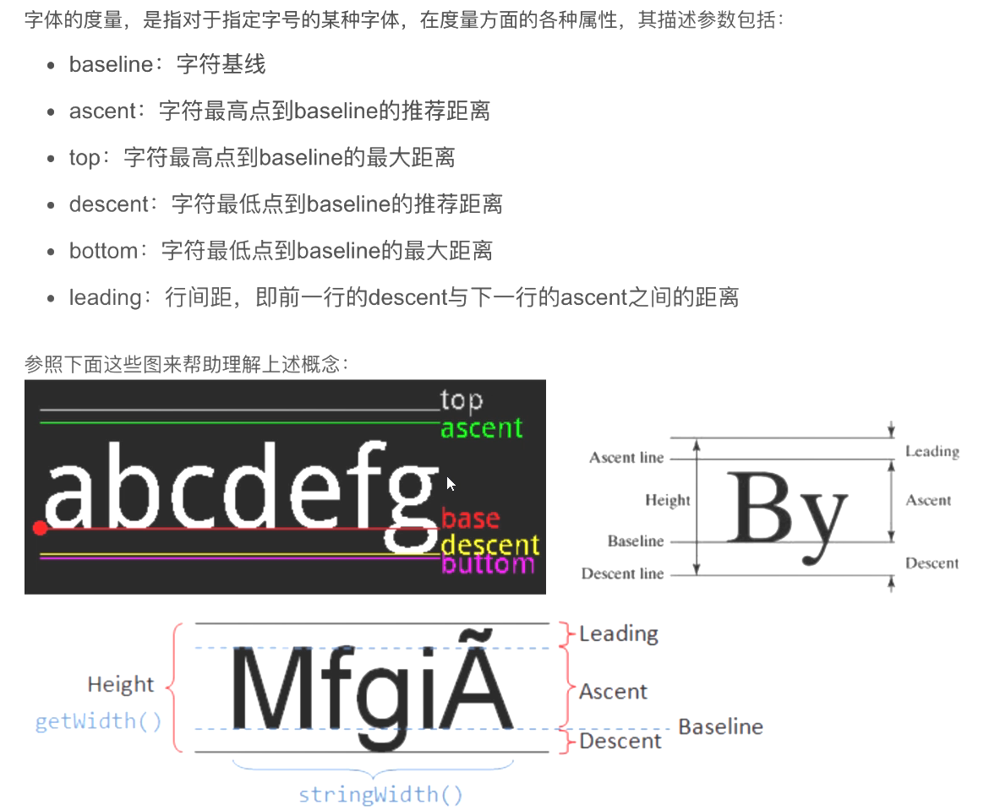
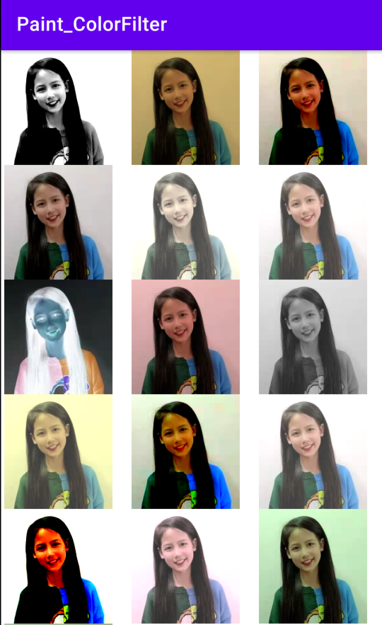
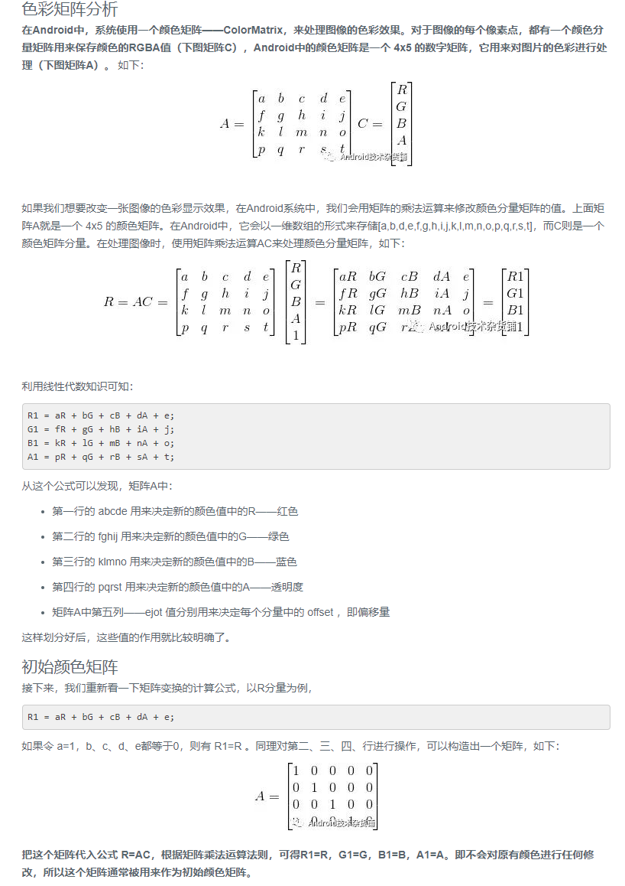

# 自定义UI

### Paint类

1. 常用方法：

```java
mPaint = new Paint();
 // 设置颜色
 mPaint.setColor(Color.RED);
 //设置 Paint对象颜色，范围为0~255
 mPaint.setARGB(255, 255, 255, 0);
 // 设置alpha不透明度，范围为0～255
 mPaint.setAlpha(200);
 //抗锯齿
 mPaint.setAntiAlias(true);
 //描边效果
 mPaint.setStyle(Paint.Style.STROKE);
 //描边宽度
 mPaint.setStrokeWidth(4);
 //圆角效果
 mPaint.setStrokeCap(Paint.Cap.ROUND);
 //拐角风格
 mPaint.setStrokeJoin(Paint.Join.MITER);
 //设置环形消染器
 mPaint.setShader(new SweepGradient(200, 200, Color.BLUE, Color.RED));
 //设置图片混合模式
 mPaint.setXfermode(new PorterDuffXfermode(PorterDuff.Mode.DARKEN));
 //设置颜色过滤器m
 mPaint.setColorFilter(new LightingColorFilter(0x00ffff, 0x000000));
 //设置双线性过滤
 mPaint.setFilterBitmap(true);
 //设置画笔遮舞滤能，传入度数和样式
 mPaint.setMaskFilter(new BlurMaskFilter(10, BlurMaskFilter.Blur.NORMAL));
 //设置文本缩放倍数
 mPaint.setTextScaleX(2);
 //设置字体大小
 mPaint.setTextSize(38);
 //对其方式
 mPaint.setTextAlign(Paint.Align.LEFT);
 // 设置下划线
 mPaint.setUnderlineText(true);
 String str = "Android";
 //测量文本大小， 将文本大小信息存放在rect
 Rect rect = new Rect();
 mPaint.getTextBounds(str, 0, str.length(), rect);
 // 获取文本的宽
 mPaint.measureText(str);
 //获取字体度量对象
 mPaint.getFontMetrics();
```

2. 文字属性

   

3. Paint颜色相关

   * setColor(int color) `参数具体的颜色值，16进制数值，OxFFFF0000`
   * setARGB(int a,int r,int g,int b) `参数分别透明度，红，绿，蓝。0-255数值`
   * setShader(Shader shader) `参数着色器对象，一般使用shader的几个子类`

     * LinearGradient:线性渲染
       * 1、构造方法：
         LinearGradient(float x0,float y0, float x1, float y1, int color0, int[] colors,float[] positions,Shader.TileMode tile)
       * 参数：
         x0y0x1y1：渐变的两个端点的位置color0 color1是端点的颜色
       * positions 浮点数组，取值0~1，表示每种颜色占比，数组的元素个数和colors数组元素个数相同
         tile:端点范围之外的着色规则，类型是TileMode
       * 使用：

       ```
       mShader = new LinearGradient(0,0,500,500,new int[]{Color.RED,Color.BLUE},null, Shader.TileMode.CLAMP);mPaint.setShader(mShader);
       canvas.drawCircle(250,250,250, mPaint);
       ```

     * RadialGradient:环形渲染
        * 构造方法：
          RadialGradient(float centerx, float centerY, float radius, int centerColor, intedgeColor, TileMode tileMode)。
        * 参数：
          centerX centerY：辐射中心的坐标
          radius:辐射半径
          centerColor:辐射中心的颜色
          edgeColor:辐射边缘的颜色
          tileMode：辐射范围之外的着色规则，类型是TileMode
          * 使用：
            ```
            mShader =new RadialGradient(250,250,250, new int[]{Color.GREEN,Color.YELLOW,Color.RED},null,Shader.TileMode.CLAMP);mPaint.setShader(mShader);
            canvas.drawCircle(250,250,250,mPaint);
            ```

     * SweepGradient:扫描渲染
        * 构造方法：
          SweepGradient(float cx, float cy, int color0, int color1)
        * 参数：
          cx cy：扫描的中心
          color0：扫描的起始颜色
          color1:扫描的终止颜色
        * 使用：
          ```
         mShader=new SweepGradient(250,250,Color.RED,Color.GREEN);mPaint.setShader(mShader);
         canvas.drawCircle(250,250,250, mPaint);
         ```
         
     * BitmapShader:位图渲染
       * 构造方法：
        BitmapShader(Bitmap bitmap, Shader.TileMode tilex, Shader.TileMode tileY)
       * 参数：
         bitmap:用来做模板的Bitmap对象
         tileX：横向的着色规则，类型是TileMode
         tileY：纵向的着色规则，类型是TileMode
         `当绘制区域超过图片本身大小时，图片的超出的像素会根据上面两个参数拉伸或重复或镜像`
       * 使用：
        mShader = new BitmapShader(mBitmap,Shader.TileMode.CLAMP,Shader.TileMode.CLAMP);mPaint.setShader(mShader);
        canvas.drawCircle(250, 250,250, mPaint);

     * **ComposeShader**:组合渲染，`例如LinearGradient+ BitmapShader`
      ```java
      /**
         * 组合渲染，
         * ComposeShader(@NonNull Shader shaderA, @NonNull Shader shaderB, Xfermode mode)
         * ComposeShader(@NonNull Shader shaderA, @NonNull Shader shaderB, PorterDuff.Mode mode)
         * shaderA,shaderB:要混合的两种shader
         * Xfermode mode： 组合两种shader颜色的模式
         * PorterDuff.Mode mode: 组合两种shader颜色的模式
         */
        BitmapShader bitmapShader = new BitmapShader(mBitmap, Shader.TileMode.REPEAT, Shader.TileMode.REPEAT);
        LinearGradient linearGradient = new LinearGradient(0, 0, 1000, 1600, new int[]{Color.RED, Color.GREEN, Color.BLUE}, null, Shader.TileMode.CLAMP);
        mShader = new ComposeShader(bitmapShader, linearGradient, PorterDuff.Mode.MULTIPLY);
        mPaint.setShader(mShader);
        canvas.drawCircle(250, 250, 250, mPaint); 
     ```

   * setColorFilter(ColorFilter colorFilter) 设置颜色过滤。一般使用ColorFilter三个子类

     * LightingColorFilter： 光照效果类：
        * 构造方法
          Lighting Color Filter(int mul, int add)
          * 参数:
            mul和add都是和颜色值格式相同的int值,其中mul用来和目标像素相乘,add用来和目标像素相加:

            R`= R * mul.R/ 0xff + add.R
            G`= G * mul.G/ 0Xff + add.G
            B`= B * mul.B/ 0xff+ add.B
          * 使用
            ```java
            ColorFilter lighting = new LightingColorFilter(oxooffff, 0X000000);
            paint.setColorFilter(lighting);
            canvas.drawBitmap(bitmap, 0,0, paint);
            
                   //红色去除掉
            //  LightingColorFilter lighting = new LightingColorFilter(0x00ffff,0x000000);
            //  mPaint.setColorFilter(lighting);
            //  canvas.drawBitmap(mBitmap, 0,0, mPaint);

            // 原始图片效果
            //  LightingColorFilter lighting = new LightingColorFilter(0xffffff,0x000000);
            //  mPaint.setColorFilter(lighting);
            //  canvas.drawBitmap(mBitmap, 0,0, mPaint);

            //  绿色更亮
            //  LightingColorFilter lighting = new LightingColorFilter(0xffffff,0x003000);
            //  mPaint.setColorFilter(lighting);
            //  canvas.drawBitmap(mBitmap, 0,0, mPaint);

            //  PorterDuffColorFilter porterDuffColorFilter = new PorterDuffColorFilter(Color.RED, PorterDuff.Mode.DARKEN);
            //   mPaint.setColorFilter(porterDuffColorFilter);
            //   canvas.drawBitmap(mBitmap, 100, 0, mPaint);
            ```

     * PorterDuffColorFilter：指定一个颜色和一种PorterDuff.Mode与绘制对象进行合成
          * PorterDuffColorFilter构造方法:
            PorterDuffColorFilter(int color, PorterDuff.Mode mode)
          * 参数:
            color,具体的颜色值，例如Color.REDmode,指定PorterDuff.Mode混合模式
          * 使用:

           ```java
           PorterDuffColorFilter porterDuffColorFilter = new
           PorterDuffColorFilter(Color.RED, PorterDuff.Mode.DARKEN);paint.setColorFilter(porterDuffColorFilter);
           canvas.drawBitmap(mBitmap,100, 0, paint);
           ```

     * ColorMatrixColorFilter:使用一个ColorMatrix 来对颜色进行处理
          * ColorMatrixColorFilter构造方法:
            ColorMatrixColorFilter(float[] colorMatrix);
          * 参数:
            colorMatrix矩阵数组
          * 使用:
          ```java
            //黑白
            public static final float colormatrix_heibai[] = {
                0.8f,1.6f,0.2f,0,-163.9f,
                8.8f,1.6f,8.2f,0,-163.9f
                ,8.8f,1.6f,0.2f,0,-163.9f,
                0, 0, 0, 1.0f,0
            };
            //怀旧
            public static final float coLormatrix_huajiu[] = {
                6.2f,0.5f,0.1f,0,40.8f,
                0.2f,0.5f,0.1f,0,40.8f,
                0.2f,0.5f,0.1f,0,40.8f,
                0, 0, 0,1,0
            };
              //哥特
              public static final float colormatrix_gete[] = {
                1.9f,-0.3f,-0.2f,0,-87.0f,
                -0.2f,1.7f,-0.1f,0,-87.0f,
                -0.1f,-0.6f,2.0f,0,-87.0f,
                0, 0,0,1.0f,0
               };
              //淡雅
              public static final float coLormatrix_danya[] = {
                6.6f,0.3f,0.1f,0,73.3f,
                0.2f,0.7f,0.1f,0,73.3f,
                0.2f,0.3f,0.4f, 0,73.3f,
                0, 0,0,1.0f,0
              };   
              float[] colorMatrix ={
                 1,0,0,0,0,//red
                 0, 1,0,0,0,//green
                 0,0,1,0,0, //blue
                 0,0,0,1,0 //alpha
              };

              mColorMatrixColorFilter = new ColorMatrixColorFilter(colorMatrix);
              mPaint.setColorFilter(mColorMatrixColorFilter);
              canvas.drawBitmap(mBitmap,100,0, mPaint);
          ```
       效果如下：
     


4. 颜色矩阵
  [参考：](https://toutiao.io/posts/ucufsw/preview)
  [参考博客](https://toutiao.io/posts/ut34qc/preview)

   

