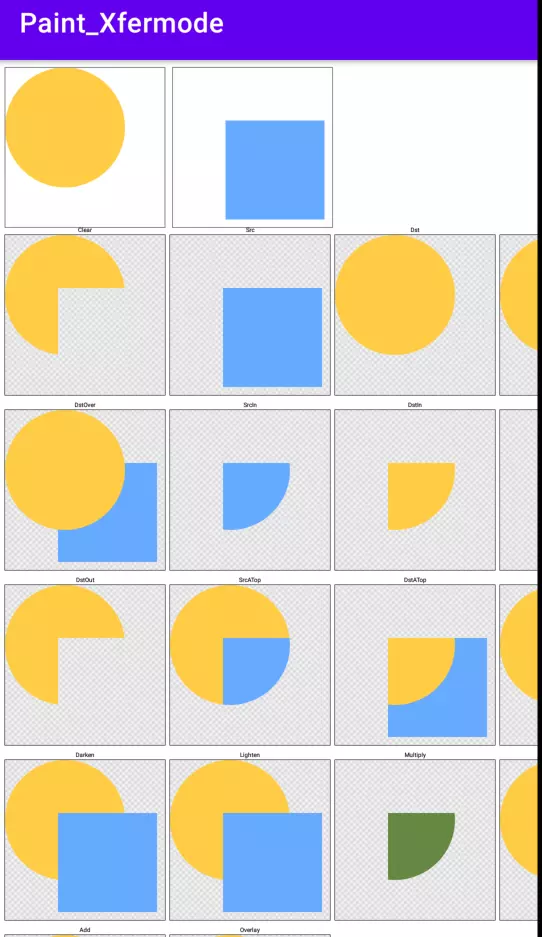

# 自定义UI

### XferMode相关

1. 概述： PorterDuff. Mode
   将所绘制图形的像素与Canvas中对应位置的像素按照一定规则进行合，形成新的像素值，从而更新Canvas中最终的像素颜色值。

   共有18种模式：

   Mode.CLEAR Mode.SRC_OVER Mode.DST_IN Mode.SRC_ATOP Mode.DARKEN
   Mode.SCREEN Mode.SRC Mode.DST_OVER Mode.SRC_OUT Mode.DST_ATOP
   Mode.LIGHTEN Mode.OVERLAY Mode.DST Mode.SRC_IN Mode.DST_OUT Mode.XOR
   Mode.MULTIPLY Mode.ADD


2. 离屏绘制
   通过使用离屏缓冲，把要绘制的内容单独绘制在缓冲层，保证Xfermode的使用不会出现错误的结果。使用离屏缓冲有两种方式:

   * Canvas.saveLayer()可以做短时的离屏缓冲，在绘制之前保存，绘制之后恢复restoreToCount:

     ```java
     int saveld=canvas. save Layer(0, 0,width,height, Canvas.ALL_SAVE_FLAG);

     Canvas.drawBitmap(rectBitmap, 0, 0, paint);//画方
     Paint.setXfermode(xfermode);//设置Xferm,
     Canvas.drawBitmap(circleBitmap, 0, 0, paint);//画圆
     Paint.setXfermode(null); //用完及时清除Xfermode

     canvas.restoreToCount(saveld);
     ```

   * View.setLayerType() //直接把整个View都绘制在离屏缓冲中。
     setLayerType(LAYER_ TYPE_HARDWARE) 使用GPU来缓冲，
     setLayerType(LAYER_ TYPE_SOFTWARE) 使用一个Bitmap来缓冲。


3. 演示效果 

> 模式说明：

```
//效果作用于src源图像区域
        private static final Xfermode[] sModes = {
                //所绘制不会提交到画布上
                new PorterDuffXfermode(PorterDuff.Mode.CLEAR),
                //显示上层绘制的图像
                new PorterDuffXfermode(PorterDuff.Mode.SRC),
                //显示下层绘制图像
                new PorterDuffXfermode(PorterDuff.Mode.DST),
                //正常绘制显示，上下层绘制叠盖
                new PorterDuffXfermode(PorterDuff.Mode.SRC_OVER),

                //上下层都显示，下层居上显示
                new PorterDuffXfermode(PorterDuff.Mode.DST_OVER),
                //取两层绘制交集，显示上层
                new PorterDuffXfermode(PorterDuff.Mode.SRC_IN),
                //取两层绘制交集，显示下层
                new PorterDuffXfermode(PorterDuff.Mode.DST_IN),
                //取上层绘制非交集部分，交集部分变成透明
                new PorterDuffXfermode(PorterDuff.Mode.SRC_OUT),

                //取下层绘制非交集部分，交集部分变成透明
                new PorterDuffXfermode(PorterDuff.Mode.DST_OUT),
                //取上层交集部分与下层非交集部分
                new PorterDuffXfermode(PorterDuff.Mode.SRC_ATOP),
                //取下层交集部分与上层非交集部分
                new PorterDuffXfermode(PorterDuff.Mode.DST_ATOP),
                //去除两图层交集部分
                new PorterDuffXfermode(PorterDuff.Mode.XOR),

                //取两图层全部区域，交集部分颜色加深
                new PorterDuffXfermode(PorterDuff.Mode.DARKEN),
                //取两图层全部区域，交集部分颜色点亮
                new PorterDuffXfermode(PorterDuff.Mode.LIGHTEN),
                //取两图层交集部分，颜色叠加
                new PorterDuffXfermode(PorterDuff.Mode.MULTIPLY),
                //取两图层全部区域，交集部分滤色
                new PorterDuffXfermode(PorterDuff.Mode.SCREEN),

                //取两图层全部区域，交集部分饱和度相加
                new PorterDuffXfermode(PorterDuff.Mode.ADD),
                //取两图层全部区域，交集部分叠加
                new PorterDuffXfermode(PorterDuff.Mode.OVERLAY)
        };
        
        @Override
        protected void onDraw(Canvas canvas) {
            canvas.drawColor(Color.WHITE);

            Paint labelP = new Paint(Paint.ANTI_ALIAS_FLAG);
            labelP.setTextAlign(Paint.Align.CENTER);

            ... ...

            int x = 0;
            int y = 0;
            for (int i = 0; i < sModes.length; i++) {
                // draw the border
                paint.setStyle(Paint.Style.STROKE);
                paint.setShader(null);
                canvas.drawRect(x - 0.5f, y - 0.5f,
                        x + W + 0.5f, y + H + 0.5f, paint);

                // draw the checker-board pattern
                paint.setStyle(Paint.Style.FILL);
                paint.setShader(mBG);
                canvas.drawRect(x, y, x + W, y + H, paint);

                // draw the src/dst example into our offscreen bitmap
                int sc = canvas.saveLayer(x, y, x + W, y + H, null, Canvas.ALL_SAVE_FLAG);
                canvas.translate(x, y);
                //目标图像
                canvas.drawBitmap(mDstB, 0, 0, paint);
                paint.setXfermode(sModes[i]);
                //源图像
                canvas.drawBitmap(mSrcB, 0, 0, paint);
                paint.setXfermode(null);
                canvas.restoreToCount(sc);

                // draw the label
                canvas.drawText(sLabels[i], x + W / 2, y - labelP.getTextSize() / 2, labelP);

                x += W + 10;

                // wrap around when we've drawn enough for one row
                if ((i % ROW_MAX) == ROW_MAX - 1) {
                    x = 0;
                    y += H + 30;
                }
            }
        }
```

