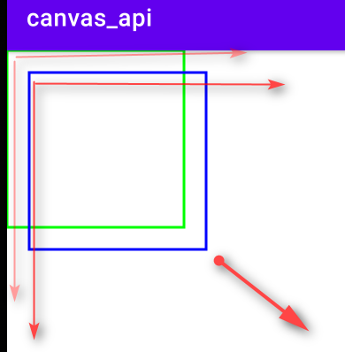
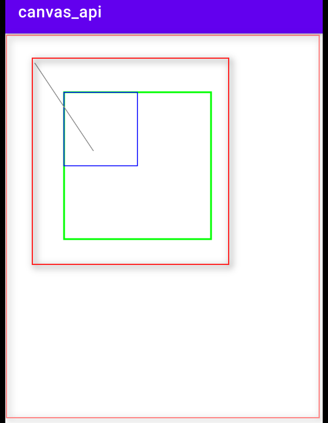
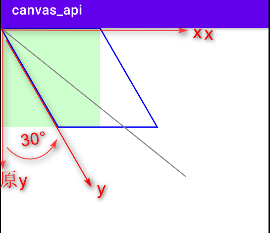
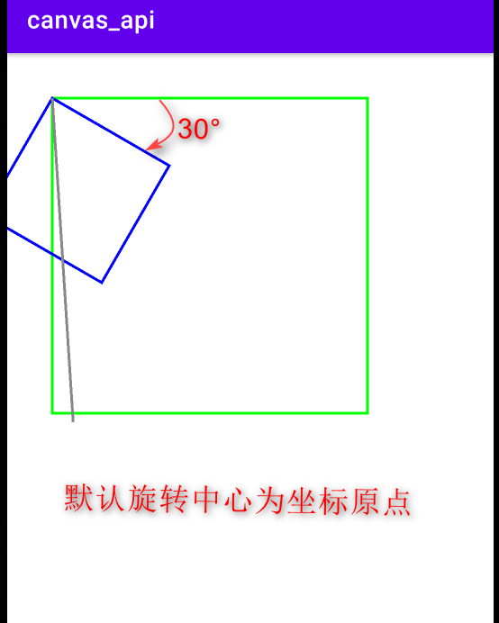
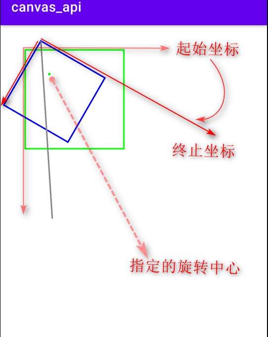
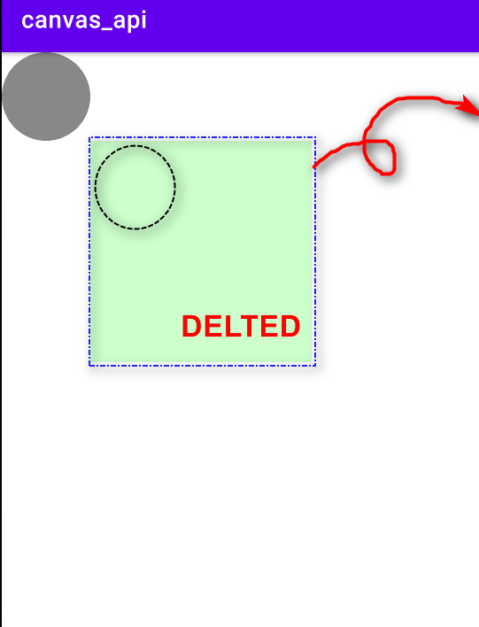

# Canvas

    画布，通过画笔绘制几何图形、文本、路径和位图等常用API分为绘制，变换，状态保存和恢复。

#### 1. **绘制**

##### 常用绘制方法

    **在指定坐标绘制位图**
    *void drawBitmap(Bitmap bitmap,float left,float top,Paint paint):* 

    **根据给定的起始点和结束点之间绘制连线**
    *void drawLine(float startX,float startY,float stopX,float stopY,Paint paint):*

    根据给定的path，绘制连线
    *void drawPath(Path path,Paint paint):。void drawPoint(float x,float y,Paint paint):*

    **根据给定的坐标，绘制文字**
    *void drawText(String text,int start,int end,Paint paint):*

##### 位置形状变化

    **平移操作**
    *void translate(float dx, float dy):*

```java
   //1，平移操作
    canvas.drawRect(0,0, 400, 400, mPaint);
    canvas.translate(50, 50);
    mPaint.setColor(Color.BLUE);
    canvas.drawRect(0,0, 400, 400, mPaint);
```
   


    **缩放操作**
    *void scale(float sx, float sy):*

```java
    canvas.drawRect(200,200, 700,700, mPaint);

    // 缩放的同时平移
    canvas.scale(0.5f, 0.5f, 200,200);
        
    mPaint.setColor(Color.BLUE);
    canvas.drawRect(200,200, 700,700, mPaint);
    mPaint.setColor(Color.GRAY);
    canvas.drawLine(0,0, 400, 600, mPaint);
```


    **倾斜操作**
    *void skew(float sx, float sy):*

   ```java
    //倾斜操作
     canvas.drawRect(0,0, 400, 400, mPaint);
     canvas.skew(0.577f, 0); //在X方向倾斜30度,tan(30) = 0.577
        //canvas.skew(0, 1); //在y方向倾斜45度
        mPaint.setStyle(Paint.Style.STROKE);
        mPaint.setColor(Color.BLUE);
        canvas.drawRect(0, 0, 400, 400, mPaint);

        mPaint.setColor(Color.GRAY);
        canvas.drawLine(0,0, 400, 600, mPaint);
   ```
   


    **旋转操作**
    *void rotate(float degrees):*

  ```java
        canvas.translate(100, 100);

        canvas.drawRect(0,0, 700,700, mPaint);
        canvas.rotate(30);
        mPaint.setColor(Color.BLUE);
        canvas.drawRect(0,0, 300,300, mPaint);
        
        mPaint.setColor(Color.GRAY);
        canvas.drawLine(0,0, 400, 600, mPaint);
  ```
    
  按指定旋转中心旋转：
  ```java
    canvas.translate(100, 100);

    canvas.drawRect(0,0, 400,400, mPaint);
    canvas.rotate(30, 100, 100); //px, py表示旋转中心的坐标
    mPaint.setColor(Color.BLUE);
    canvas.drawRect(0,0, 300,300, mPaint);

    mPaint.setColor(Color.GRAY);
    canvas.drawLine(0,0, 400, 600, mPaint);
  ```
  


    **切割操作，参数指定区域内可以继续绘制**
    *void clipXXX(…):*  
    **反向切割操作，参数指定区域内不可以绘制**
    *void clipOutXXX(…):*   
   ```java
     /*canvas.drawRect(200, 200,700, 700, mPaint);
        mPaint.setColor(Color.GRAY);
        canvas.clipRect(200, 200,700, 700); //画布被裁剪
        canvas.drawCircle(100,100, 100,mPaint); //坐标超出裁剪区域，无法绘制
        canvas.drawCircle(300, 300, 100, mPaint); //坐标区域在裁剪范围内，绘制成功*/

        canvas.drawRect(200, 200,700, 700, mPaint);
        mPaint.setColor(Color.GRAY);
        canvas.clipOutRect(200,200,700,700); //画布裁剪外的区域
        canvas.drawCircle(100,100,100,mPaint); //坐标区域在裁剪范围内，绘制成功
        canvas.drawCircle(300, 300, 100, mPaint);//坐标超出裁剪区域，无法绘制
   ```
   
   

    **可通过matrix实现平移，缩放，旋转等操作**
    *void setMatrix(Matrix matrix):*
   ```java
    canvas.drawRect(0,0,700,700, mPaint);
        Matrix matrix = new Matrix();
        matrix.setTranslate(50,50);
        matrix.setRotate(45);
        matrix.setScale(0.5f, 0.5f);
        canvas.setMatrix(matrix);
        mPaint.setColor(Color.GRAY);
        canvas.drawRect(0,0,700,700, mPaint);
   ```

